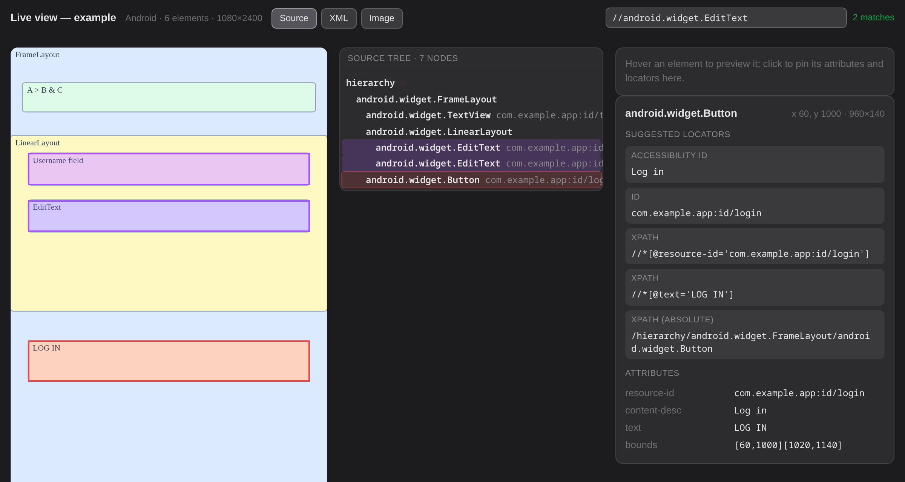
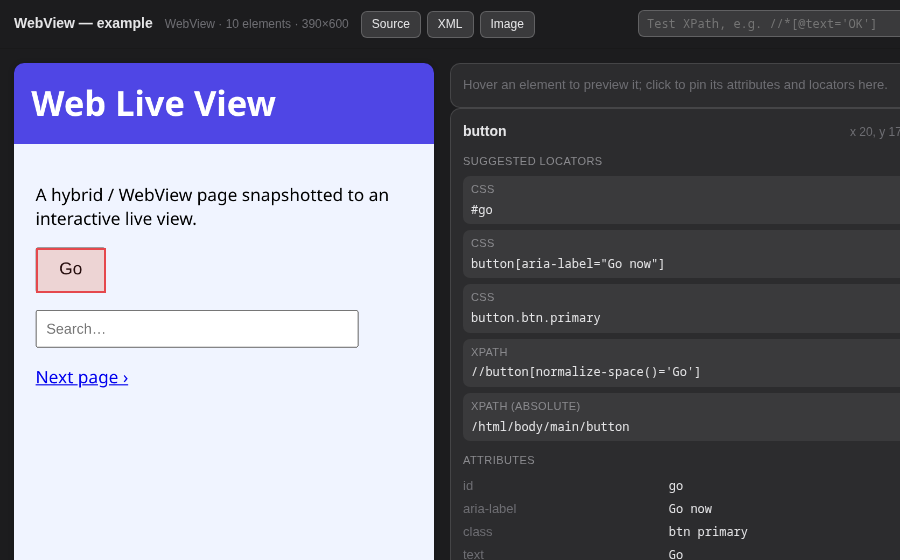

# appium-live-view-plugin

[](https://pypi.org/project/appium-live-view/)
[](https://github.com/v-dermichev/appium-live-view-plugin)
[](LICENSE)

An [Appium](https://appium.io) plugin that turns the active session's **page
source + screenshot** into a single, self-contained, interactive **HTML "live
view"** — the [Appium Inspector](https://github.com/appium/appium-inspector)
experience (hover to highlight an element, click to pin its attributes and
suggested locators) — and hands that HTML back to the test client via
`execute('liveView: …')`.

Because it returns a ready-to-use HTML string over the standard Execute Script
endpoint, it is **consumer-agnostic**: any Appium client (Python, Java, JS, …)
can grab it and drop it straight into a report. Attaching it to Allure is one
line:

```python
allure.attach(html, "Live view", allure.attachment_type.HTML)
```



*(Example, not a real device — the screenshot with element overlays, a selectable
source tree, an XPath tester, and per-element locators.)*

**See also:** [Python package](python/) (build the view from Python, no Node) ·
[inline-interactive Allure 3 patch](examples/allure-inline-interactive/) (make the
attachment interactive inside the report).

## How the "live view" mapping works (extracted from Appium Inspector)

The data half of Inspector's screenshot↔source mapping is small and pure; it is
reimplemented here without a DOM (`lib/parse.js`) so it runs both on the server
and inside the rendered page:

- `parseCoordinates(attrs)` → `{x1,y1,x2,y2}` from Android `bounds="[x1,y1][x2,y2]"`
  or iOS `x`/`y`/`width`/`height`.
- `parseSource(xml)` → flat node list with per-node rect, path, attributes, and
  the source coordinate **extents** (largest `x2`/`y2`).
- Overlays are positioned as **percentages of the extents**, so they line up on
  the screenshot regardless of device pixel density (no scale-ratio math).

`lib/locators.js` adds suggested locators (accessibility id, id/resource-id,
attribute-scoped XPath, absolute XPath). `lib/render.js` assembles the HTML.

## Install & enable

```bash
# from git (git source REQUIRES --package with the package name)
appium plugin install --source=git \
  https://github.com/v-dermichev/appium-live-view-plugin.git \
  --package appium-live-view-plugin
# or from a local checkout
appium plugin install --source=local /path/to/appium-live-view-plugin
# or from npm (once published)
appium plugin install --source=npm appium-live-view-plugin

# enable it (alongside any other plugins)
appium --use-plugins=liveView
```

Requires Appium 2 or 3. No system dependencies; no runtime npm dependencies
beyond `@appium/base-plugin`.

## Commands

```js
// Health check — assert the plugin is loaded.
await driver.execute('liveView: status');
// -> { available: true, plugin: 'liveView', version: '0.1.0' }

// Render the CURRENT screen (plugin grabs source + screenshot itself).
const html = await driver.execute('liveView: render', [{ title: 'Login screen' }]);

// Render data you already captured (e.g. the exact state a step observed).
const html2 = await driver.execute('liveView: render', [{
  title: 'After tap',
  source: capturedPageSourceXml,   // optional; captured now if omitted
  screenshot: capturedBase64Png,   // optional; captured now if omitted
  selectedPath: '1.2.0',           // optional; pre-pin an element by its node path
}]);
```

`render` returns the HTML document as a string, ready to attach.

### Parameters (all optional)

| param | default | meaning |
|-------|---------|---------|
| `title` | `Appium live view` | header / document title |
| `source` | live `getPageSource()` | page-source XML to render |
| `screenshot` | live `getScreenshot()` | base64 PNG to render |
| `selectedPath` | – | node `path` to pre-select (dot-separated child indices) |
| `platformName` | session caps | shown in the header |

## Allure usage

### Python (pytest + allure-pytest)

```python
import allure

def attach_live_view(driver, name="Live view", **kwargs):
    html = driver.execute_script("liveView: render", kwargs)
    allure.attach(html, name, allure.attachment_type.HTML)

# in a test / fixture / failure hook:
attach_live_view(driver, title="Checkout screen")
```

### JavaScript (WebdriverIO)

```js
const html = await browser.execute('liveView: render', [{ title: 'Cart' }]);
await allure.addAttachment('Live view', html, 'text/html');
```

Inside the Allure report the attachment shows the screenshot with hoverable,
clickable element overlays. Open it in a new tab for copy-to-clipboard locators
and the XPath tester.

## Interactions

- **Hover** an element → highlight + tooltip.
- **Click** an element → pin it; the panel shows its attributes and suggested
  locators.
- **Click a locator** → copies it (whole card is the target; shows `Copied ✓`).
- **XPath tester** (top-right) → type an XPath to highlight all matching
  elements; the status shows the match count, `no match`, or `invalid XPath`.
- **Source** (header) → toggle a source tree where **every** node is selectable
  — including elements with no bounds, or hidden behind others, that can't be
  clicked on the screenshot. Selecting a row pins the element and shows its panel.
- **XML** / **Image** (header) → download the page source and screenshot
  (right-click also offers *Save link as*). Viewing happens in place — the source
  tree shows the XML, the stage shows the screenshot — because Allure's sandboxed
  iframe blanks a blob opened in a new tab.

Hover, click-to-pin, and the source tree are pure CSS and work **inline** in
Allure. Copy, the XPath tester, and the XML/Image links need JavaScript. They work when the attachment is opened
**standalone** (new tab / download), and also **inline** if the report applies
the optional runtime patch below.

The live view marks its root with `data-appium-live-view` and embeds the page
source as `data-src` (base64) — both survive DOMPurify — so a report-side script
can drive the interactive features without the attachment shipping any JS itself.

### Optional: make it interactive inline in Allure 3

Allure renders `text/html` attachments with DOMPurify (scripts stripped) inside
`<iframe sandbox="allow-same-origin">` (no `allow-scripts`), so an attachment's
own JS never runs inline. A post-generation report patch can restore it: for each
attachment iframe whose (already sanitized) content carries the
`data-appium-live-view` marker, it swaps the sandboxed `blob:` iframe for a
`srcdoc` iframe with `allow-scripts` and injects the interactivity script. `srcdoc`
inherits the report's origin, so this works for **served and single-file** reports.
Only the live-view frames are touched; every other attachment keeps Allure's
original script-less sandbox. A ready-to-use, dependency-free patch + Allure
config (works on any setup, no hardcoded paths) is in
[`examples/allure-inline-interactive/`](examples/allure-inline-interactive/).

## Use without the plugin (client side)

The renderer is framework-agnostic — you can build the live view from any
`(page source XML, screenshot)` pair captured over WebDriver, without installing
the plugin on the server (handy when a Selenium Grid fronts the Appium nodes):

```js
import { buildLiveViewHtml } from 'appium-live-view-plugin/lib/render.js';

const xml = await driver.getPageSource();
const screenshot = await driver.getScreenshot();      // base64 PNG
const html = buildLiveViewHtml({ xml, screenshot, title: 'Login screen' });
// then attach `html` as text/html to your report
```

Run `npm test` for the unit tests (parser, locators, renderer).

### Python

A Python port lives in [`python/`](python/) — same live view, no Node needed,
for pytest + allure-pytest stacks:

```python
from appium_live_view import build_live_view_html

html = build_live_view_html(driver.page_source, driver.get_screenshot_as_png())
allure.attach(html, "Live view", allure.attachment_type.HTML)
```

Its CSS + runtime JS are shared verbatim with the JS renderer (regenerated by
`tools/extract-assets.mjs`), so both produce the same result.

## WebView / hybrid context

In a WebView context `driver.page_source` is HTML with no coordinates, so a DOM
snapshot script (`WEB_SNAPSHOT_JS`) captures each element's tag, attributes and
`getBoundingClientRect()` into the same bounds-annotated source the live view
uses. Take a screenshot of the **web viewport**; the renderer auto-detects the
web context and suggests **CSS + DOM-XPath** locators.

```js
import { WEB_SNAPSHOT_JS } from 'appium-live-view-plugin/lib/web-snapshot.js';
import { buildLiveViewHtml } from 'appium-live-view-plugin/lib/render.js';

// in the webview context:
const source = await driver.executeScript(WEB_SNAPSHOT_JS);
const shot = await driver.getScreenshot();
const html = buildLiveViewHtml({ xml: source, screenshot: shot, context: 'web' });
```

```python
from appium_live_view import WEB_SNAPSHOT_JS, build_live_view_html

source = driver.execute_script(WEB_SNAPSHOT_JS)
html = build_live_view_html(source, driver.get_screenshot_as_png(), context="web")
```

`context` is auto-detected from the snapshot's `<webview>` root; pass
`context="web"`/`"native"` to force it.



## Limitations

- Inline in Allure, only CSS interactions run by default (hover + click-pin);
  copy and the XPath tester need JS — available when the attachment is opened
  standalone, or inline via the optional report patch above (script sandbox).
- WebView overlays line up with a **web-viewport** screenshot; a full device
  screenshot (with native chrome above the webview) would need an offset.
- Overlap handling is DOM stacking (smaller/deeper element wins hit-testing), not
  the centroid fan-out Appium Inspector draws for exactly-overlapping elements.

## License

MIT
